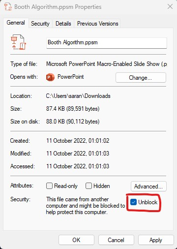
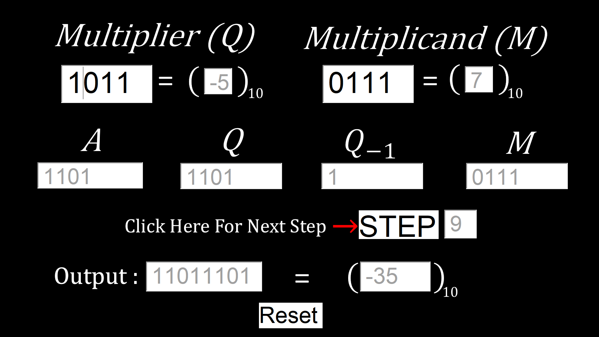

# Booth's Algorithm Simulation
 A basic step-by-step simulation of Booth's algorithm on 4-bit signed numbers using MS-PowerPoint Macros.

# Steps to run the project

- **Step 1:** Clone the repository on a PC running on windows operating system with microsoft power-point already installed.
- **Step 2:** Right-Click on the "Booth Algorithm.ppsm" from the repo, go to "Properties" and mark "Unblock" (as shown below).

   
 

 
 - **Step 3:** Execute "Booth Algorithm.ppsm" to finally run the simulation.

# Technologies used
 - Visual Basic for Applications (MS-PowerPoint Macros)

# Snapshot of an example simulation

